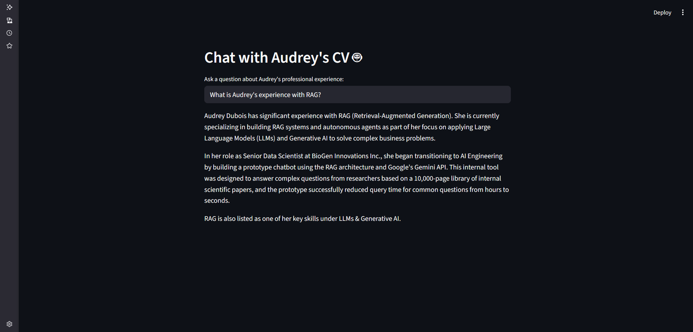

# RAG Chatbot with Google Gemini & LangChain

### A project to build a Question-Answering (Q&A) chatbot that answers questions based on a custom document, using the RAG (Retrieval-Augmented Generation) architecture.


## Project Overview

This project demonstrates how to build an advanced, context-aware chatbot using state-of-the-art Generative AI techniques. The application implements the **Retrieval-Augmented Generation (RAG)** pattern to answer questions about a specific document—in this case, a fictional CV.

Instead of relying on a model's general knowledge, this chatbot leverages a custom-built **vector database** to find relevant information within the provided document and uses that context to generate accurate, factual answers. This approach is fundamental to creating powerful, domain-specific AI assistants.

## Key Features & Skills Demonstrated

*   **State-of-the-Art GenAI:** Implementation of the **RAG** architecture, which is the industry standard for building knowledge-based LLM applications.
*   **LangChain Framework:** Proficient use of `LangChain` to orchestrate the entire RAG pipeline, including document loading, splitting, and building the final Q&A chain.
*   **Vector Databases:** Creating and querying a **FAISS** vector store. This involves:
    *   **Embeddings:** Using a Hugging Face sentence transformer model to convert text chunks into numerical vectors.
    *   **Similarity Search:** Retrieving the most relevant document chunks based on a user's query.
*   **Google Gemini Integration:** Using the latest `gemini-2.5-flash` model via the `langchain-google-genai` integration for the final answer generation step.
*   **Interactive UI:** Building a user-friendly web interface with **Streamlit**, allowing for real-time interaction with the chatbot.
*   **Secure API Key Management:** Using `python-dotenv` to manage the Google API key securely.

## How to Run This Project

1.  **Get a Google API Key:**
    *   Go to the [Google AI Studio](https://aistudio.google.com/) and create an API key.
    *   Create a local `.env` file and store your key: `GOOGLE_API_KEY='YOUR_API_KEY'`

2.  **Clone the repository and set up the environment:**
    ```bash
    git clone https://github.com/takzen/rag-chatbot-gemini.git
    cd rag-chatbot-gemini
    uv venv -p 3.11
    source .venv/bin/activate
    uv pip install -r requirements.txt
    ```

3.  **Create the Vector Store:**
    Run the one-time script to process the source document and create the local FAISS database:
    ```bash
    python train_vector_store.py
    ```

4.  **Run the Streamlit Application:**
    ```bash
    streamlit run app.py
    ```
    Your web browser should open a new tab with the running chatbot.

## Application Preview


*A preview of the RAG chatbot answering a question based on the provided CV.*